# Advent of FPGA 2025

This repo contains my attempts at solving Advent of Code 2025 problems in HDL for the [Advent of FPGA competition](https://blog.janestreet.com/advent-of-fpga-challenge-2025/). Some ideas for solving puzzles my come from [my attempts at solving these problems in software](https://github.com/rates37/aoc-2025).

## Summary of Results

The table below summarises which problems have been successfully solved, the HDL used (Verilog/Hardcaml), and the number of clock cycles used to solve my personal puzzle's input for each day. The 'size' of each puzzle's input has been noted for each day (using my personal puzzle input file). The discussions below often test with various size inputs, not just my personal puzzle inputs. As per [the Advent of Code Rules](https://adventofcode.com/2025/about#faq_copying), sharing of actual inputs is not permitted, so feel free to provide your own input text files (these should be formatted in the exact same format as the Advent of Code site provides). However, in my own investigation and benchmarking of my designs, I wrote my own scripts to generate sample inputs of varying sizes. These functions can be found in [`generate_input.py`](/verilog/scripts/generate_input.py).

| Day               | Solved (Verilog/Hardcaml/Both) | Clock Cycles | Input Size                                           |
| ----------------- | ------------------------------ | ------------ | ---------------------------------------------------- |
| [Day 1](#day-1)   | Both                           | 19,691       | 4780 rotations                                       |
| [Day 2](#day-2)   | Both                           | 1,729        | 38 ranges                                            |
| [Day 3](#day-3)   | Verilog                        | 20,217       | 200 lines (100 chars per line)                       |
| [Day 4](#day-4)   | Verilog                        | 37,108       | 137 x 137 grid                                       |
| [Day 5](#day-5)   | Verilog                        | 66,649       | 177 ranges, 1000 query IDs                           |
| [Day 6](#day-6)   | Verilog                        | 35,139       | 4 numeric rows, 1000 operators, ~3709 chars per line |
| [Day 7](#day-7)   | Verilog                        | 121,496      | 142 x 142 grid                                       |
| [Day 8](#day-8)   | Verilog                        | 1,744,510\*  | 1000 x,y,z coordinates                               |
| [Day 9](#day-9)   | Verilog                        | 1,341,548    | 496 coordinates                                      |
| [Day 10](#day-10) | Verilog                        | 58,319,971   | 177 machines (up to 13 x 10)                         |
| [Day 11](#day-11) | Verilog                        | 66,542       | 583 device names                                     |
| [Day 12](#day-12) | Hardcaml                       | 25,098       | 6 shapes, 1000 region queries                        |

\* Day 8's solution not guaranteed to produce correct results. However it is overwhelmingly likely to produce correct results on typical puzzle inputs. Refer to the [Day 8 section](#day-8) below for details.

## Notable days:

This readme is quite long, as it contains full explanations of the solutions used, key implementation details, and other points of discussion that I thought would be interesting to mention. I tried to do something interesting for each day, but some particular highlights I'm proud of include:

- [Day 2](#day-2): Derived an $\mathcal{O}(1)$ formula to count invalid numbers in each range

- [Day 8](#day-8): Came up with a heuristic to avoid needing to store $\mathcal{O}(N^2)$ (~1 million) edges for a dense connected graph

- [Day 9](#day-9): Pipelined approach to reduce $\mathcal{O}(N^3)$ solution into an $\mathcal{O}(N^2k)$ amortised solution

- [Day 11](#day-11): CSR graph representation + DSU implementation in Verilog

# How to run:

## Verilog:

Running the Verilog testbenches requires [iverilog](https://steveicarus.github.io/iverilog/). Setup instructions have been included below:

<details>
    <summary>
        <strong>Click to expand/collapse installation instructions.
        </strong>
    </summary>
    <h3>macOS</h3>
        <ol>
            <li>Install <a href="https://brew.sh/">Homebrew</a> if you haven't already:</li>
            <pre><code>/bin/bash -c "$(curl -fsSL https://raw.githubusercontent.com/Homebrew/install/HEAD/install.sh)"</code></pre>
            <li>Install Icarus Verilog</li>
            <pre><code>brew install icarus-verilog</code></pre>
            <li>Verify Installation:</li>
            <pre><code>iverilog -v</code></pre>
        </ol>
    <h3>Windows</h3>
        <ol>
            <li>Download Icarus Verilog:</li>
            <ul>
                <li>Visit the <a href="https://bleyer.org/icarus/">Icarus Verilog download page</a></li>
                <li>Download the latest Windows installer supported by your computer</li>
                <li>Run the installer and follow the prompts. Make sure to select "Add to PATH" during installation.</li>
            </ul>
            <li>Verify Installation: open cmd or powershell and run:<br /> 
                <pre><code>iverilog -v</code></pre>
            </li>
        </ol>
    <h3>Ubuntu/Debian/WSL2</h3>
        <ol>
            <li>Install Icarus Verilog</li>
            <pre><code>sudo apt update
sudo apt install iverilog</code></pre>
            <li>Verify Installation:</li>
            <pre><code>iverilog -v</code></pre>
        </ol>
</details>

Uses [iverilog](https://steveicarus.github.io/iverilog/) as a simulator, for simplicity and ease of use. Each subdirectory in the [`verilog`](verilog/) has a Makefile to compile/run the testbench for that specific puzzle. `make run` will run the testbench with the puzzle input from `input.txt`. To change where the input file is read from, use the `INPUT_FILE` argument, as shown in the example below:

```sh
user@machine ~/advent-of-fpga-2025 $ cd ./verilog/day02

user@machine ~/advent-of-fpga-2025/day02 $ make run
iverilog -o day02_tb.out -Pday02_tb.INPUT_DATA_FILENAME=\"input.txt\" day02_tb.v day02_core.v ../utils/rom.v period_summer.v range_summer.v
vvp day02_tb.out
INFO: Day02 solver started.
Day 2 Complete
Part 1 Result: 40398804950
Part 2 Result: 65794984339
Took 1729 clock cycles
day02_tb.v:90: $finish called at 17385000 (1ps)

user@machine ~/advent-of-fpga-2025/day02 $ make run INPUT_FILE="sample_input.txt"
iverilog -o day02_tb.out -Pday02_tb.INPUT_DATA_FILENAME=\"sample_input.txt\" day02_tb.v day02_core.v ../utils/rom.v period_summer.v range_summer.v
vvp day02_tb.out
INFO: Day02 solver started.
Day 2 Complete
Part 1 Result: 1227775554
Part 2 Result: 4174379265
Took 561 clock cycles
day02_tb.v:90: $finish called at 5705000 (1ps)
```

Note: You cannot use spaces in the file path argument (or you need to escape them).

## Hardcaml:

Install requirements:

```sh
opam install hardcaml hardcaml_waveterm ppx_hardcaml stdio dune
```

Build project / run with input text file as argument:

```sh
user@machine ~/advent-of-fpga-2025 $ cd ./advent-of-hardcaml

user@machine dune build

user@machine dune exec ./day01/day01_tb.exe -- ./day01/sample_input.txt
Loading input from file: ./day01/sample_input.txt
Loaded 39 characters into rom
Day 01 complete
Part 1 result: 3
Part 2 result: 6
Took 41 clock cycles
```

# Design Approaches / Discussion

## Day 1:

Day 1's puzzle was about the simulation of a rotary dial with the numbers from 0-99 being rotated left and right, and counting how many times the dial is on zero at the end of a rotation (part 1), as well as how many times the dial head passes zero at any point in the rotation (part 2).

This task very naturally lends itself to a simple FSM that tracks the dial's current position, updating it with each new rotation action that is read in, and incrementing the `part1_result` and `part2_result` accumulator output registers with each rotation. These updates can be calculated in $\mathcal{O}(1)$ time using simple combinational logic / arithmetic.

The general logic flow in my design for day 1 is as follows:

- The decoder module reads the input character by character and converts ASCII into a rotation 'instruction', which is comprised of a single bit to indicate direction, along with a number to indicate how many dial positions to rotate by.

- When the decoder encounters a newline or end of file, it asserts a `valid_pulse` output flag, which triggers the solver module to update its model of the dial, and the puzzle output registers accordingly.

This means that since the decoder is reading input characters one by one and the solver module can perform each instruction with a single clock cycle, the decoder is the bottleneck of the system. This would suggest that the duration to solve the puzzle scales linearly with the number of input characters / number of rotations in the input file.

There isn't much interesting to discuss for day 1's puzzle due to its simplicity and innate serial nature. I'll use this space to give a brief introduction to the general high-level structure of solutions. Each day generally has the following structure:

<p align="center">
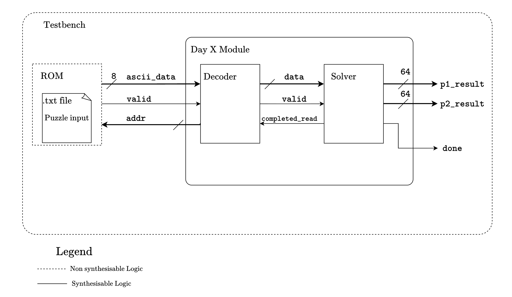
</p>

For day 1, this structure has been emphasised by the separate modules / files:

- The solver logic is in [`solver.v`](verilog/day01/solver.v)
- The decoder logic is in [`decoder_fsm.v`](verilog/day01/decoder_fsm.v)
- The encapsulating module is in [`day01_core.v`](verilog/day01/day01_core.v)
- The ROM module is in [`rom.v`](verilog/utils/rom.v)
- The testbench is in [`day01_tb.v`](verilog/day01/day01_tb.v)

For future days, often the decoding and solving logic are either able be done in parallel or are more inter-related, and have just been written directly into the encapsulating "core" module.

The `day01_core` module header is shown below (every day's core module has an almost identical header, with only minor differences being in the parameters):

```v
module day01_core #(
    parameter N_ADDR_BITS = 16, // number of bits required to fully address the ROM module (i.e., bits to count number of characters in input file)
    parameter INPUT_DATA_WIDTH = 16,
    parameter OUTPUT_DATA_WIDTH = 16
) (
    // Synchronous inputs:
    input wire clk,
    input wire rst,

    // IO to interface with ROM:
    input wire [7:0] rom_data,
    input wire rom_valid,
    output reg [N_ADDR_BITS:0] rom_addr,

    // results:
    output wire [OUTPUT_DATA_WIDTH-1:0] part1_result,
    output wire [OUTPUT_DATA_WIDTH-1:0] part2_result,
    output reg done
);
```

### Benchmarking and Evaluation

This design's performance was evaluated on various input sizes ranging from 10 to 1000 rotations, using the number of clock cycles as a rudimentary performance benchmark. To run these benchmarks yourself, you can use the `benchmark_day01` function from [`benchmark.py`](verilog/scripts/benchmark.py#L152) (will generate test input files, run the testbench and check that the expected answers are correct, and output a plot like the one seen below, as well as raw csv data from the benchmarks).

In the plot below, clock cycles were measured over an average of 5 trials per input size (each trial is a unique randomly generated input with the same number of rotations). Error bars showing stdev are also included.

<p align="center">
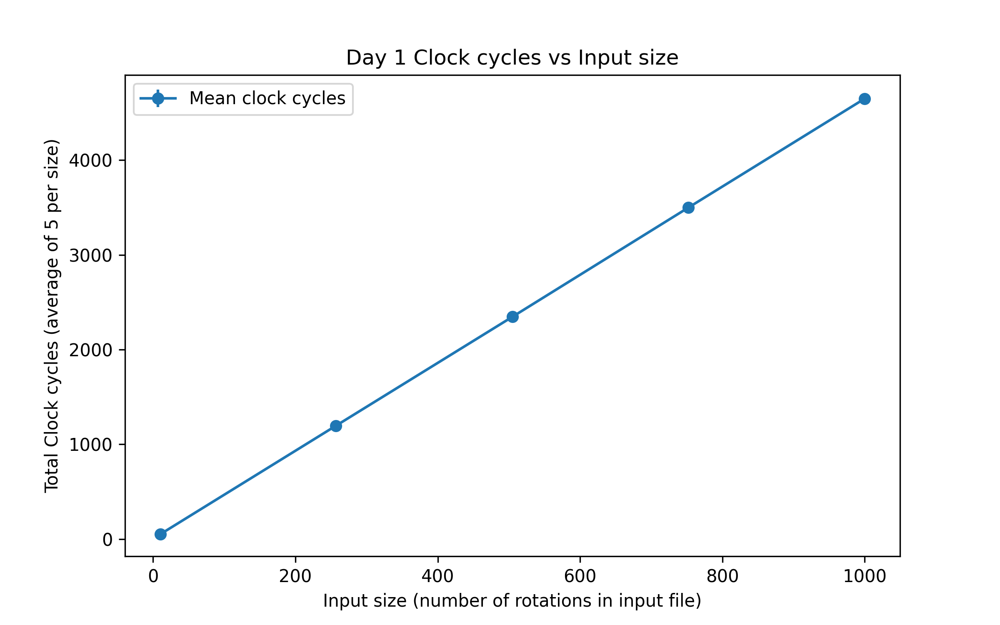
</p>

As expected, the number of clock cycles required scales linearly with the number of rotations in the input file, and since reading input is the bottleneck of this system, there is little to no variance in the number of clock cycles taken for a given input size.

### Scalability, Efficiency, and Architecture

Since all that this module needs to store is the current dial position and the outputs from part 1 and 2, this design will typically use a constant amount of logic/registers.

For inputs where the accumulated results will exceed $2^{16}-1$, the parameter `OUTPUT_DATA_WIDTH` should be increased, which will increase the number of registers used by the solver module. For inputs where the amount rotated by will exceed $2^{16}-1$, the parameter `INPUT_DATA_WIDTH` should be increased, which will increase the number of registers used in the decoder module, as well as the width of the wire that passes rotation amount from the decoder to the solver module. Both of these cases are highly unlikely given the nature of the puzzle.

### Key Synthesis Metrics:

The design was compiled using Quartus Prime Lite 18.1 with the target device as a 10M50DAF484C7G (the FPGA on the DE10-lite dev board) and produced the following key usage metrics:

| Metric                             | Usage              |
| ---------------------------------- | ------------------ |
| Logic Elements                     | 753 / 49,760 (2%)  |
| Registers                          | 95                 |
| Memory Bits                        | 0 / 1,677,312 (0%) |
| Embedded Multiplier 9-bit elements | 0 / 288 (0%)       |
| Restricted Fmax (Slow 1200mV 85C)  | 20.6 MHz           |

## Day 2:

Day 2's puzzle involved determining the sum of all of the 'invalid' numbers in a series of ranges of positive integers. Invalid numbers are defined as follows:

- For part 1: An invalid number is a number with $D$ digits, that is formed by taking a number with $D/2$ digits and repeating it twice. For example, $123123$ is invalid because it can be formed by repeating $123$ twice.

- For part 2: An invalid number is a number with $D$ digits that is formed by repeating a number with $L$ digits (where $L \lt D$) at least twice. For example $121212$ is invalid because it can be formed by repeating $12$ three times.

My approach for this involved reducing this from an iterative programming problem to a simple maths sum. I'll briefly go over the way I arrived at this answer below:

### Journey to solution:

The most straight-forward approach to solving part 1 of this problem might look something like the following:

```
func sum_invalid_in_range(A, B):
    total <- 0
    for x in [A .. B]:
        if first_half(x) == second_half(x):
            total <- total + x
    return total
```

However, this approach is extremely inefficient, since the longer the bounds of the range are, the more valid numbers that will needlessly be inspected.

So rather than iterate over _all_ numbers in the range from $A$ to $B$, we could instead just take the first half of the starting number (call it the "seed"), and check if repeating it twice is less than the upper limit of the range. We can then just increment the first half of the number and continue this process. This way, instead of iterating over all numbers in the range, we are simply iterating over invalid numbers until we exceed the limit of the range. This might look like the following:

```
func sum_invalid_in_range_v2(A, B):
    total <- 0
    current <- first_half(x)
    while current <= B:
        candidate <- repeat_twice(current)
        if A <= candidate  <= B:
            total <- total + candidate
        current <- current + 1
    return total
```

This approach is significantly better, however for large numbers (as ranges in the problem input often cover anywhere the range of 64-bit integers), it still suffers from iteration.

To improve on this, we can make the observation that this sum can be expressed as a scaled arithmetic series. For example, take the range $[123012, 127146]$. The sum of the invalid numbers in this range is the sum: $123123 + 124124 + 125125 + 126126 + 127127$.

While it doesn't look exactly like an arithmetic series, we can express it as the following sum

$$
\begin{align*}
\text{sum} &= &123 &+ &124 &+ &125 &+ &126 &+ &127 &+ \\  &  &123000 &+ &124000 &+ &125000 &+ &126000 &+ &127000 \\
&= &(123 &+ &124 &+ &125 &+ &126 &+ &127) &+ \\  & &1000 ( 123 &+ &124 &+ &125 &+ &126 &+ &127 )
\end{align*}
$$

Which we can re-write as the sum of numbers from $123$ to $127$ (which can be trivially computed as $(123+127)*(127-123+1)/2$) multiplied by $1001$. The multiplier of 1001 is used here, because the numbers in the input range are all length 6, and so to "concatenate" a 3-digit number with itself, we can multiply it by 1001. Different digit lengths would require different multipliers. To put it in a straight-forward (and probably easier-to-read) formula:

$$
\begin{align*} \text{Total Sum} &= \sum_{S=S_{min}}^{S_{max}} (S \times M) \\ &= M \times \sum_{S=S_{min}}^{S_{max}} S \\ &= M \times \frac{(S_{min} + S_{max}) \times Count}{2} \end{align*}
$$

Okay, so now this gives us a $\mathcal{O}(1)$ formula to find the sum of invalid numbers within a given range (using the part 1 definition of invalid numbers), so it's given an $\mathcal{O}(\texttt{num ranges})$ algorithm to solve part 1! Note this assumes all ranges start and end with the same number of digits, if this is not the case, then a range can be decomposed into two or more ranges. For example, the range $[12, 3049]$, we can convert it into three ranges with consistent length of both bounds: $[12-99], [100-999], [1000-3049]$. Since we are dealing with 64-bit integers, the largest number is 20 decimal digits, i.e., the largest possible range will be converted into ten ranges with bounds of equal length.

Great, but part 2 complicates things a little, by allowing any number of repetitions >= 2. This part uses the same core logic as above, but requires careful handling of seeds of different length. I'll start by explaining the general approach, then highlighting the flaw and how my solution overcomes it.

We can easily find multipliers that can "concatenate" a number with itself many times. The multiplier $M$ is a decimal number with 0s in all digit places except those places that are at multiples of $L$ (the length of the seed), where it is 1 (**using zero-indexing of digits**). As an example, to "concatenate" the number 123 with itself three times, we would multiply it by $M = 1001001$.

So, we can simply use seeds of different length from length 1 to half the length of the numbers in the target range. For example, if we are looking at a range $[123456, 753213]$, then we would check seeds of length 1, 2, and 3, since invalid numbers with 6 digits can be formed by any of:

- repeating a 1-digit number 6 times
- repeating a 2-digit number 3 times
- repeating a 3-digit number 2 times

At first glance, it seems like this would work, and produces correct outputs for many ranges, however, it fails to account for the case where an invalid number is included in a sum multiple times because it falls into one or more of these options.

For example, the number 111111 may be:

- generated by the seed 1 being repeated 6 times
- generated by the seed 11 being repeated 3 times
- generated by the seed 111 being repeated 2 times

If we naively sum the results for seeds of length 1,2,3 we will have counted 111111 three times. Instead, we can only check seeds with a length that is a **maximal proper divisor** of the length of the numbers in the target range. This eliminates cases like 12121212 being counted twice by $L=2$ and $L=4$, because 2 is not a maximal proper divisor. However it still doesn't account for the 111111 case, since it would still be counted in $L=2$ and $L=3$ sums.

To account for this, I used an approach similar to that of finding unions of sets. Suppose $A$ is the sum using $L=2$, and $B$ is the sum using $L=3$. We want to find $| A \cup B |$, and to do this, we use the rule: $|A \cup B| = |A| + |B| - |A \cap B|$. So we need to subtract the numbers that lie in both $L=2$ and $L=3$ ranges, because they would otherwise be counted twice. These numbers that lie in the intersection are numbers formed using seeds of length 1. But in general, it's the seeds of length `gcd(2,3)` (`gcd` is the greatest common divisor). So by subtracting the sums using length of the gcd of maximal proper divisors, we can remove this double-counting, and finally arrive at a solution for part 2 that is $\mathcal{O}(1)$ work per range (again with the assumption of using 64-bit integers).

### Implementation of Solution in Hardware

Since this problem has been reduced to effectively the evaluation of a math formula for each range, the implementation side is relatively straight-forward (provided you understand the logic laid out above).

To help with implementation, I first coded up this approach in Python, which can be seen in [my Advent of Code (software) repo](https://github.com/rates37/aoc-2025/blob/main/day02/day02_p2_optimised.py). Rather than manually computing the seed lengths to add and subtract, we can pre-compute these (since there are only 20 different number digit lengths to consider).

My hardware implementation closely aligns with the Python solution linked above. I have:

- A [`period_summer`](verilog/day02/period_summer.v) module, that computes the sum of all $D$-digit numbers in the range $[A, B]$ that are formed by repeating an $L$-digit number, where $D$ and $L$ are inputs to the module.

- A [`range_summer`](verilog/day02/range_summer.v) module, that evaluates a sum for an entire range, performing adding the sums with seeds of length that is a maximal proper divisor, and subtracting the sums with seeds of length that is the gcd of all maximal proper divisors. It then uses a `period_summer` submodule to evaluate each of these sums.

- A [`day02_core`](verilog/day02/day02_core.v) module that encapsulates all solution logic and exposes a similar I/O interface to all other days. This module does the work of decoding input, splitting input ranges (where the lower and upper limits of the range my be of different lengths) into separate ranges where both limits are the same length, and accumulating the results for part 1 and part 2.

### Benchmarking and Evaluation

My day 2 solution was evaluated in a similar manner to day 1. It was similarly evaluated over an average/stdev of 5 runs. Tested with varying the number of input ranges, and those ranges can span the range of 64 bit integers. My puzzle input had 37 ranges to evaluate. The plot below evaluates number of ranges between 10 and 1000 (significantly larger than the real puzzle input).

<p align="center">
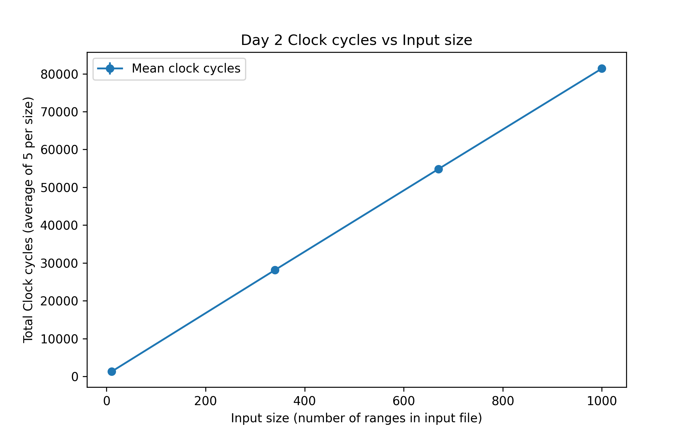
</p>

Since the solution I outlined above is $\mathcal{O}(1)$ for each range, we see that the number of clock cycles appears to scale linearly with respect to the number of ranges, and is effectively invariant to the actual numbers that the range spans.

### Scalability, Efficiency, and Architecture

The `period_summer` module takes 5 clock cycles to evaluate a consistent range, and the largest ranges take 3 evaluations of a period to add maximal divisor length sums and subtract gcd length sums, meaning ranges are evaluated in a relatively low number of clock cycles.

There is a possibility for improvement by adding additional `period_summer` submodules to the `range_summer` module, to allow multiple ranges to be processed in parallel. However, given that input is read character-by-character, it is likely that the decoder/parsing stage will quickly become the computation bottleneck. In an effort to save on resource usage, I decided not to add a secondary range summer in my solution, and I decided the module was "efficient enough" and moved on with other days.

### Key Synthesis Metrics:

The design was compiled using Quartus Prime Lite 18.1 with the target device as a 10M50DAF484C7G (the FPGA on the DE10-lite dev board) and produced the following key usage metrics:

| Metric                             | Usage                |
| ---------------------------------- | -------------------- |
| Logic Elements                     | 7,956 / 49,760 (16%) |
| Registers                          | 1353                 |
| Memory Bits                        | 0 / 1,677,312 (0%)   |
| Embedded Multiplier 9-bit elements | 74 / 288 (26%)       |
| Restricted Fmax (Slow 1200mV 85C)  | 13.15 MHz            |

## Day 3:

### Approach Description:

Day 3's problem was about selecting batteries from battery banks to achieve a maximum joltage. This puzzle is essentially a task to find the largest increasing subsequences for each row of the input of length 2 (for part 1) and length 12 (for part 2).

A naive approach to solving this (and [the approach I took when initially solving this problem in C++](https://github.com/rates37/aoc-2025/blob/main/day03/day03.cpp)) is to take each row and iterate over it two/twelve times to find the largest increasing subsequence of length 2/12, greedily selecting the largest character found in a given range. Brief pseudocode for this approach is shown below:

```
func get_largest_inc_subseq(s: string, n: integer):
    position <- 1
    total <- 0

    for k in [0 .. n-1]:
        bestChar <- s[pos + 1]
        bestPos <- pos + 1

        // ensure enough characters remain for next loop iteration
        lastIdx <- length(s) - (n-k)

        // scan:
        for i in [pos+1 .. lastIdx]:
            if s[i] > bestChar:
                bestChar <- s[i]
                bestPos <- i

        // add largest character to total and update position:
        total <- total * 10 + int(bestChar)
        pos <- bestPos
    return total
```

However, this approach can be quite inefficient, particularly for long lines, since we are iterating over the same string of characters multiple times. Instead, we can use additional memory to track positions of all seen digits. In pseudocode, this might look like the following:

```
func get_largest_inc_subseq(s: string, n: integer):
    // list of positions where digit d appears:
    posList <- array[10][]

    // single scan to build position lists:
    for i in [1 .. length(s)]:
        d <- int(s[i])
        posList[d].append(i)

    // build output:
    pos <- 0
    total <- 0

    for k in [0 .. n-1]:
        lastIdx <- length(s) - (n-k)

        for d in [9 .. 0]:
            for p in posList[d]:
                if p > pos and p <= lastIdx:
                    total <- total * 10 + d
                    pos <- p
                    go to next iteration of outer loop
    return total
```

This approach sacrifices additional memory to save on the work of scanning the input string multiple times. However in software, this equates to the same amount (if not more) as the original approach.

### Implementation in hardware

Rather than using lists, in hardware, we can use bitmaps and combinational logic to find the next digit to select each iteration much faster.

My approach makes use of 10 position bitmaps to store the input row, where:

- `bitmap[9]` contains a `1` at every index where the digit is a 9
- `bitmap[8]` contains a `1` at every index where the digit is a 8
- ...

For each bitmap from 9 to 0, we can apply a mask to only consider the valid range. If the masked bitmap is not zero, we immediately know that the current digit is the best digit and we don't need to check smaller digits. A priority encoder can then be used to find the first set bit index, so we know how to update the current pos.

This effectively turns a search over a string (may have arbitrary length) into a search over a fixed size 10 possible digits.

Another optimisation made was to use two bitmaps rather than one. This allows the decoder to read in the next line while the current line is being processed, like what is shown in the diagram below.

<p align="center">
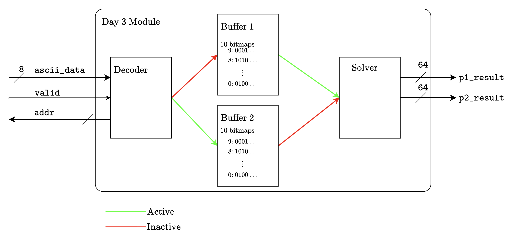
</p>

This ensures that all logic in the design is being utilised as much as possible, and avoiding data stalls as much as possible.

In retrospect, this design is okay, however the logic depth does get quite extensive, and could likely be improved by introducing additional stages to find the next best digit to select. If I get time before submitting, I'll try and refactor this change.

### Benchmarking and Evaluation

My day 3 solution was evaluated in a similar manner to day 1. It was similarly evaluated over an average/stdev of 5 runs. Tested with varying the number of input ranges, and those ranges can span the range of 64 bit integers. My puzzle input had 37 ranges to evaluate. The plot below evaluates number of ranges between 10 and 1000 (significantly larger than the real puzzle input).

<p align="center">
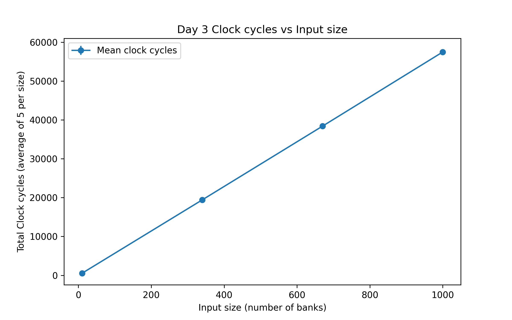
</p>

As the logic to evaluate a single line takes a constant number of clock cycles, the number of clock cycles used scales approximately linearly with the number of banks (rows) in the input file.

### Scalability

Since the solver only needs to read in 1 (or 2) lines at a time, the number of banks (rows) in the input file can be arbitrarily increased without the design needing to change.

To handle longer input rows (more characters per line), the `MAX_LINE_LEN` parameter in the `day03_core` module can be increased and the logic usage will grow accordingly. My puzzle input only had 100 characters per line and so this was what I tested synthesis with (results below). Architecture and efficiency has been discussed above.

### Key Synthesis Metrics:

The design was compiled using Quartus Prime Lite 18.1 with the target device as a 10M50DAF484C7G (the FPGA on the DE10-lite dev board) and produced the following key usage metrics:

| Metric                             | Usage                 |
| ---------------------------------- | --------------------- |
| Logic Elements                     | 10,657 / 49,760 (21%) |
| Registers                          | 2970                  |
| Memory Bits                        | 0 / 1,677,312 (0%)    |
| Embedded Multiplier 9-bit elements | 0 / 288 (0%)          |
| Restricted Fmax (Slow 1200mV 85C)  | 20.61 MHz             |

## Day 4:

Day 4's puzzle was a grid-based problem. The puzzle input was a square grid of '.' and '@' characters, representing empty squares and rolls of paper. A roll of paper is 'accessible' by the elves' fork-lift if it has less than 4 rolls of paper in the surrounding 8 positions (up, down, left, right, and the four diagonals). The aim of part 1 of this puzzle is to count the number of accessible rolls of paper in the input grid. Part 2 of this puzzle was to remove the accessible rolls repeatedly, until there are no more accessible rolls in the grid.

Day 4's puzzle didn't have much challenging regarding understanding the solution, as it is a relatively simple approach of iteratively traversing the grid, row-by-row, counting accessible cells (storing the count on the first iteration for part 1 result), and updating the grid cells.

### Implementation in Hardware

Today's puzzle was the first where the entire input needed to be stored. Since the input size is so large (137x137 = 18,769 characters for my personal puzzle input), it is infeasible to store grids of this size in registers.

<details>
    <summary>
        <strong>Click to expand/collapse short explanation (<s>rambling</s>) about memory and registers in FPGAs. Not important to understanding the solution but might be interesting to some readers.
        </strong>
    </summary>
    In FPGA chips, there are different ways bits can be stored - the two ones of interest here are registers and block RAMs. They are handled very differently and there are different amounts in the chip itself.
    <br/>
    <br/>
    Registers are individual D-flip-flops, which store a single bit. Typically, the FPGA has one register in each logic cell (the smallest unit on an FPGA), and it is located directly next to the LUTs. Registers are very fast and have low latency. Another benefit to registers is that they can be written to in parallel, multiple per clock edge (e.g. can perform thousands of writes simultaneously). The main drawback of registers is that there are not many of them - a medium to large-sized FPGA might have 200,000 logic cells, but that only equates to about 25kB of data storage. Another drawback is that because they support large numbers of updates per clock edge, complex (or careless) use of registers can inadvertently synthesise a very large amount of logic.
    <br/>
    <br/>
    Block RAM (BRAM, Memory Bits, M9K, etc.) is another form of memory that is included in most FPGAs. Rather than being distributed and sparse like registers, they are dense memory components within the FPGA, typically made with SRAM blocks, more like cache memory in a CPU. Within the FPGA, each unit is distributed throughout (so that logic cells in different regions of the FPGA may access memory blocks that are closer to them). They are large arrays of memory (on a DE10-lite FPGA, the one that I have access to, they are referred to as "Intel M9K" embedded memory blocks). The key difference is that block RAM is <b>sequential</b>, meaning each block often only supports read/writes of 1 or 2 addresses per clock cycle. This makes accessing lots of the data simultaneously difficult, as it often adds an additional clock cycle of latency between each access, and memory needs to be loaded from a specific address rather than freely immediately accessed at any point. These are often used for data storage, buffers, FIFOs, ROMs, etc.
</details>
<br/>

Since the grid is too large to feasibly fit within registers (without dramatically affecting the interconnecting logic), I created 1-port and 2-port RAM modules that provide an addressable interface to a block ram of configurable size. Often this would be done through vendor-specific methods (e.g., Quartus' IP Wizard feature), however to ensure ease of use for simulation, I wrote these modules from scratch. Depending on the capability of the EDA Synthesis tool, it may or may not be able to infer block memory. For me, Quartus 18.1 Prime Lite was able to infer M9K elements for my target device (Max 10 10M50DAF484C7G).

As for my actual approach in Verilog, I used a sliding window approach. To count whether a roll in a given row is accessible, we need to observe its neighbours, which lie in the current row, the row above, and the row below. I created a combinational [`row_logic`](verilog/day04/row_logic.v) module, that takes in the window of three rows, and outputs a 1-hot vector for the current row, indicating whether or not each cell is accessible.

The [`day04_core`](verilog/day04/day04_core.v) module reads the grid into a RAM module, using a single bit for each cell, (storing '@' characters as 1, and '.' characters as 0), then proceeds to iteratively fetch the rows in the window from ram, and count the accessible cells in each row. The 1-hot accessible row vector is stored as a mask, and after processing the next row, the mask is used to update the grid in RAM, as the next state of the grid row can be computed using a bitwise AND; `next_curr_row <= curr_row & ~accessible`, as this will effectively 'turn off' the bits where accessible rolls of paper are located.

This process is repeated over and over until no cells are changed after an entire sweep of the grid, at which point the puzzle is complete.

### Benchmarking and Evaluation

My day 4 solution was evaluated in a similar manner to previous days. It was similarly evaluated over an average/stdev of 5 runs. Tested with varying the dimensions of the input grid, and randomly generating which cells are paper/empty with a random density in the range 0.45-0.65. My real puzzle input had a 137x137 grid to evaluate. The plot below evaluates grid sizes between 10^2 and 250^2 (a decent amount larger than the real puzzle input).

<p align="center">

</p>

As the grid size is quadratic with with respect to the width/height, a slight quadratic trend can be observed in the plot above, as the input file is still read character by character. However, since row-processing occurs in parallel, the remainder of the computation is $\mathcal{O}(N)$, which explains the sort of 'flattened' or wider shape of the graph.

It's also noted that the stdev error bars can be seen to grow as input size increases, which is due to the random nature of the generated inputs and the fact that the number of times the grid needs to be traversed is dependent on the input contents (not just the size).

### Scalability

Since the solver needs to store the entire input grid, the overall scalability of this solution is somewhat limited, in that if there are not enough memory blocks in the target device, the design itself will become unsynthesisable. Furthermore, the `row_logic` module processes an entire row in parallel, which is synthesisable for the 100-200 width rows, however significantly larger than this would require the module to be refactored, into an iterative one, perhaps processing "blocks" of the input window over multiple clock cycles, rather than the entire window at once.

The size of the puzzle input to the design has been parameterised, so the input size can be changed easily.

```verilog
module day04_core #(
    parameter N_ADDR_BITS = 16,
    parameter MAX_ROWS = 250, // my puzzle input was 137x137
    parameter MAX_COLS = 250,
    parameter LOG2_MAX_COLS = 8,
    parameter LOG2_MAX_ROWS = 8
)
```

### Key Synthesis Metrics:

The design was compiled using Quartus Prime Lite 18.1 with the target device as a 10M50DAF484C7G (the FPGA on the DE10-lite dev board) and produced the following key usage metrics:

| Metric                             | Usage                   |
| ---------------------------------- | ----------------------- |
| Logic Elements                     | 7,028 / 49,760 (14%)    |
| Registers                          | 1172                    |
| Memory Bits                        | 19,044 / 1,677,312 (3%) |
| Embedded Multiplier 9-bit elements | 0 / 288 (0%)            |
| Restricted Fmax (Slow 1200mV 85C)  | 2.82 MHz                |

Note: The above was compiled with the grid size parameters set to 137x137, since those are the dimensions of my puzzle input. The relatively low Fmax is almost definitely due to the purely combinational [`row_logic`](verilog/day04/row_logic.v) module, used to count the neighbors of an entire row and identify the accessible cells from the entire current row. This approach is not extremely scalable, and if it were applied to a significantly larger problem input size, it should be split up across multiple clock cycles, with a sliding-window approach, as described in the section above.

## Day 5:

Day 5's puzzle input was split into two main sections; a series of invalid ID ranges, and a longer selection of individual IDs. Part 1 of the puzzle required you to find the sum of the individual IDs that fall into one of the invalid ID ranges. Part 2 of the puzzle was to find the total number of invalid IDs, which was made slightly more difficult by the fact that some of the invalid IDs in the input may overlap with one another.

### Implementation in Hardware

[My approach](verilog/day05/) to solving this puzzle was to read in the invalid ID ranges, and sort them based on their lower bound. This sorting has two benefits. The first is that now that the ranges are sorted, we can perform an $\mathcal{O}(N)$ operation to merge overlapping IDs with one another. The second benefit is that now, when querying if one of the individual IDs fall into these invalid ranges, we can use binary search to find a containing interval (if it exists), rather than needing to perform a linear search. While linear search is simpler and would require slightly less hardware, the reduced amount of computation required makes binary search more than worth it.

Like day 4, I made use of synchronous RAM modules to store the ranges, which results in increased number of clock cycles required.

Initially, I implemented a bubble sort algorithm to perform sorting, as it was simple to implement, but after getting the module working, I moved to an insertion-sort based algorithm. Despite having the same worst case Big-O complexity, insertion sort has a much better performance in practice than other $\mathcal{O}(n^2)$ sorting algorithms, while still only needing a constant amount of extra space. I did consider implementing more complex sorting algorithms, however seeing that the size of my puzzle input only had 177 invalid ID ranges to sort, I predicted that the performance improvement from other algorithms that might be theoretically much faster would not be worth the effort.

Another benefit of using insertion sort is that it is an online algorithm, meaning it can be performed as the input is being read in, rather than needing to read in the entire input before beginning searching.

### Benchmarking and Evaluation

My day 5 solution was benchmarked similarly to previous days. It was evaluated over an average/stdev of 5 runs. Tested with varying both the number fo invalid input ID ranges, as well as the number of query IDs. My real puzzle input had 177 invalid ID ranges and 1000 IDs to query. The plots below evaluates number of ranges between 10 and 250 (a decent amount larger than the real puzzle input).

<p align="center">
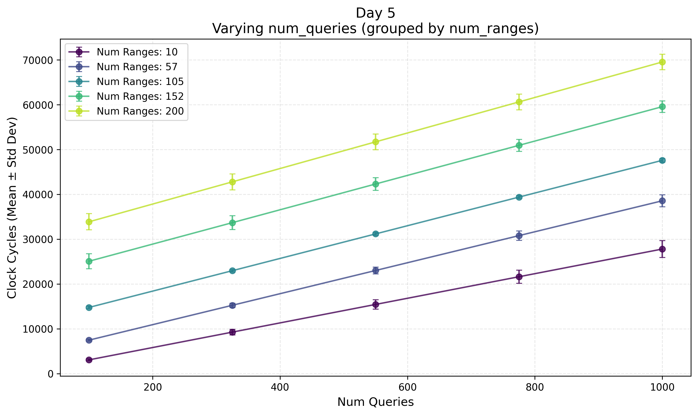
</p>

<p align="center">
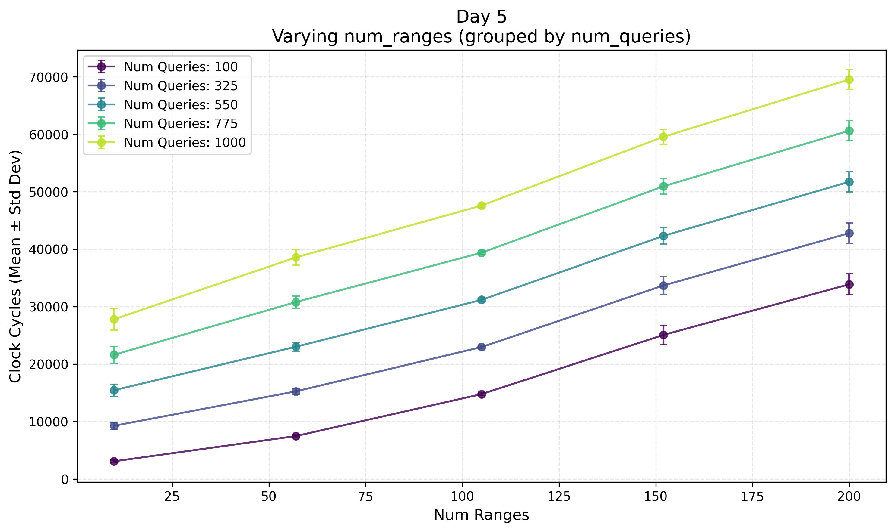
</p>

The shape of the lines on the first plot shows the relationship between number of query IDs and number of clock cycles, and it appears very linear. This is expected, as there is likely very little variance in the number of clock cycles required for each query operation (due to the efficiency of binary search).

The shape of the lines on the second plot shows the relationship between number of invalid ID ranges and number of clock cycles. While there is some gradual change, it doesn't appear quite linear, which is expected, since insertion sort is a quadratic time algorithm. However, since the number of ranges are still so small, the relationship isn't clearly captured by this graph.

### Scalability, Efficiency, Architecture

Since the solver needs to store all ranges, the memory required for this storage becomes the primary constraint on scalability. In my implementation, I stored ranges as 64-bit tuples `(low, high)`. The number of memory bits on the 10M50DAF484C7G (a relatively cheap and small FPGA) is around 1.66 million, allowing for storing over 12,000 ranges, which is orders of magnitude greater than the number required for my input to this puzzle.

One optimisation that could be made is combining the merging process with the insertion process, this could reduce the amount of memory required to store the ranges, as many ranges would likely be combined or completely enveloped by other ranges that have already been read in, thus requiring less memory.

Since the ranges are stored in a synchronous RAM, my design doesn't really allow for much parallelism in terms of processing multiple IDs at once, however since IDs are read in character-by-character, it often takes 13-15 clock cycles to read in each query ID (as often query IDs are over 14 digits long), which given the efficiency of binary search (particularly on arrays of ranges as short as 177), means that sometimes the bottleneck is actually the reading of input, rather than the actual searching process.

### Key Synthesis Metrics:

The design was compiled using Quartus Prime Lite 18.1 with the target device as a 10M50DAF484C7G (the FPGA on the DE10-lite dev board) and produced the following key usage metrics:

| Metric                             | Usage                   |
| ---------------------------------- | ----------------------- |
| Logic Elements                     | 1,610 / 49,760 (3%)     |
| Registers                          | 878                     |
| Memory Bits                        | 46,080 / 1,677,312 (3%) |
| Embedded Multiplier 9-bit elements | 0 / 288 (0%)            |
| Restricted Fmax (Slow 1200mV 85C)  | 90.57 MHz               |

This design achieved a notably higher Fmax that other days so far, which I believe is likely due to the fact that most operations being performed are simple comparisons or memory writes, all of which have very short critical paths, unlike other days where signals must propagate through arithmetic or other complex combinational paths. It was compiled with the `MAX_RANGES` parameter (the parameter that dictates the amount of memory used) set to 180.

## Day 6:

Day 6's puzzle input is a large math worksheet, containing a series of numbers stacked vertically with an operator (either addition or multiplication) in the bottom row. Each problem is separated by columns where all rows contain a space character.

Part 1 of the puzzle required interpreting the numbers horizontally (as we would normally read) and applying the operator to evaluate that problem. The required output is then the sum of the results of all problems.

Part 2 of the puzzle was similar, however required the reading of numbers vertically rather than horizontally.

### Implementation in Hardware

[My approach](verilog/day06) to solving this puzzle was to load the entire worksheet into memory, then perform a single left-to-right scan across all columns. During this scan, both part 1 and 2 results are computed in parallel for each problem.

The accumulation of each part's results needed to be handled slightly differently due to their specifications. Since part 1 required reading horizontally, we must accumulate each row's number separately, and only reduce after the entire problem has been read. Meanwhile, part 2 requires reading vertically, and since we iterate on column (not on row), part 2 can be accumulated as we iterate (i.e., there's no need to store the values separately for part 2 like there was for part 1).

To assist with implementation, I wrote a [reference python solution](verilog/day06/reference_sol.py), that aims to align with the FSM as closely as possible, which definitely helped in debugging a lot (and is something I did for a lot of future days as well).

Since the puzzle input is read character by character, this necessitates the usage of a synchronous memory block rather than registers (as my puzzle input was over 16k characters total, and storing this in registers for asynchronous random access is infeasible). This introduces latency, but is an necessary drawback.

Since today's solution didn't have much unique about it, I set myself the additional goal of only using a single multiplier (rather than separate multipliers for part 2 accumulation and part 1 accumulation). To do this, I added a `S_MULT` state to the FSM, and combined with a `next_state` register, this acts as a very rudimentary 'subroutine' similar to how subroutines might be implemented in an assembly language; i.e., set the return address (or in this case, the next state), and then jump to the subroutine label (in this case, set the current state to `S_MULT`). An example usage is shown in the snippet below, from the part of my code where the part 1 result is being accumulated:

```verilog
// set inputs to the multiply 'subroutine':
mult_a <= p1_acc;
mult_b <= p1_nums[curr_y];
// set the return state:
next_state <= S_BLOCK_REDUCE;
// jump to multiplication subroutine
state <= S_MULT;
```

Since this approach requires a single linear scan over all rows, it's performance scales linearly with the number of columns in the input. Since the number of rows in the input was very small, I took this to be a characteristic of the input, and mainly benchmarked with increasing the width of rows, rather than changing the height of columns.

### Benchmarking and Evaluation

My day 6 solution was benchmarked similarly to previous days. It was evaluated over an average/stdev of 5 runs. Tested with varying the number of math problems from 10 to 1000, using numbers up to four digits, and is shown in the plot below. My real puzzle input had 1000 math problems and numbers up to three digits.

<p align="center">
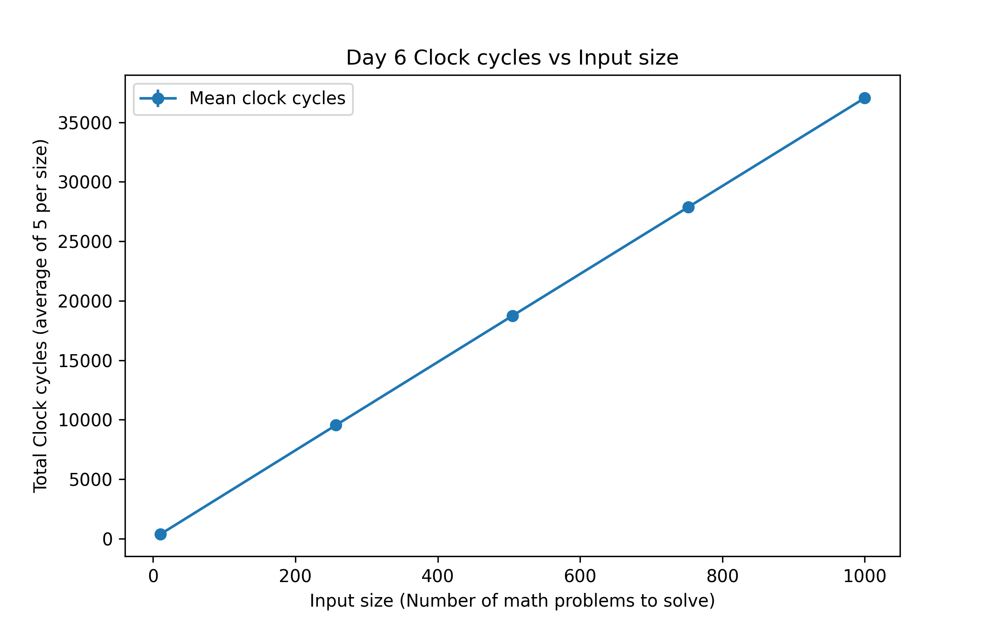
</p>

Note: in generating inputs, I limited the value of the number to be smaller for multiplication math problems (3 digits for multiplication problems, vs 4 digits for addition problems), simply to limit the likelihood of integer overflow with results that could exceed the range of 64-bit unsigned integers. This was a property I observed in my real puzzle input as well, so I took it as a reasonable restriction to place on my generated input as well.

### Scalability, Efficiency, Architecture, and Potential Improvements

The main constraint on the scalability is the RAM required to store the input file, while the design was synthesised with a RAM size that is significantly larger than my puzzle input (and only utilising a small fraction of the available memory bits on my cheap FPGA), scaling to arbitrary sizes still becomes infeasible.

One potential improvement is the use of wider rams: using wider words (e.g., 32-bits or 64-bits) could allow processing multiple columns per cycle, or even just reducing the number of required RAM reads, both of which would significantly reduce the number of clock cycles required.

### Key Synthesis Metrics:

The design was compiled using Quartus Prime Lite 18.1 with the target device as a 10M50DAF484C7G (the FPGA on the DE10-lite dev board) and produced the following key usage metrics:

| Metric                             | Usage                     |
| ---------------------------------- | ------------------------- |
| Logic Elements                     | 3,038 / 49,760 (6%)       |
| Registers                          | 995                       |
| Memory Bits                        | 262,144 / 1,677,312 (16%) |
| Embedded Multiplier 9-bit elements | 20 / 288 (7%)             |
| Restricted Fmax (Slow 1200mV 85C)  | 25.31 MHz                 |

## Day 7:

Day 7's puzzle was about simulating a tachyon beam traveling through a "tachyon manifold" grid. The beam enters the grid in the top row at a position marked "S" and travels directly downwards, until it hits a non-empty, splitter cell, (marked with a "^" character). When the beam hits a splitter, it stops, and emits news beam in the columns to the left and right of the current column.

Part 1 asks for the total number of splitters that are hit by a beam. Part 2 takes a "many worlds" view on the simulation, and each time a beam hits a splitter, it considers two separate timelines to have been created (one where it went in the left column, and one where it went in the right column). The part 2 answer is the total number of timelines after the beams pass through the bottom row.

### Implementation

Rather than tracking / simulating timelines individually, we can reduce this to a dynamic programming / counting problem - each splitter that the beam passes through will double the number of timelines from that point onwards.

If we define the value a cell in the DP / memoisation table as:

$\texttt{memo[r][c]}:= \text{Number of timelines that end up with a beam passing through this cell}$

We can then use the following pseudo-code / algorithm to fill out the DP table:

```
startPos = grid[0].indexof('S')
memo = [[0...]...] // initially all zeros
memo[0][startPos] = 1

For every cell (r,c) with memo[r][c] > 0, update row r+1 as:

if grid[r][c] == '.': // empty
    memo[r+1][c] += memo[r][c]

else if grid[r][c] == '^': // splitter
    memo[r+1][c+1] += memo[r][c]
    memo[r+1][c-1] += memo[r][c]
```

In practice, since we only ever need the previous row of timeline counts to compute the next row, we only need to store two rows in memory. In my implementation, I used a double-buffered approach; each row, read from one ram (RAM A) and write to the other (RAM B), then once the current row is finished, swap (now we read from RAM B and write to RAM A).

Since we only need to consider a single row of the input, and the input file is only '^' and '.' characters (aside from the starting position in the first row), each row can be loaded in and stored as a bitmap representation (0 = empty, 1 = splitter). So the FSM alternates between reading in a row and processing/computing the next row of the DP table over and over until the end of the input file has been reached.

A single RAM with the size of two rows of the DP table is used, and the memory layout uses the first `ROW_LEN` entries to store one row, and the remainder of the RAM to store the other row. A flag `current_ram_sel` is used as a flag to alternate between the two regions of the RAM memory, as shown in the snippet below:

```verilog
// Address calculation for double-buffered RAM
wire [ADDR_BITS-1:0] read_buf_base = current_ram_sel ? MAX_WIDTH : 0;
wire [ADDR_BITS-1:0] write_buf_base = current_ram_sel ? 0 : MAX_WIDTH;
```

Since each row is read in, and then used to compute the next row of timeline counts (DP table), the performance is expected to align closely with the number of characters in the input (as each row is effectively being read in once and traversed once).

### Scalability

Since only two rows of the DP table need to be stored, this design is quite scalable, and can be made bigger or smaller by changing the `MAX_WIDTH` parameter in the `day07_core` module. By storing the current row of the input grid as a bitmap, it is also quite compact and thus can scale quite well before logic usage on the FPGA becomes a limiting factor.

### Benchmarking and Evaluation

My day 7 solution was benchmarked similarly to previous days. It was evaluated over an average/stdev of 5 runs. Tested with varying the dimensions of the input grid from 10x10 to 250x250, with a splitter density of around 25%, and is shown in the plot below. My real puzzle input had a 142x142 grid.

<p align="center">
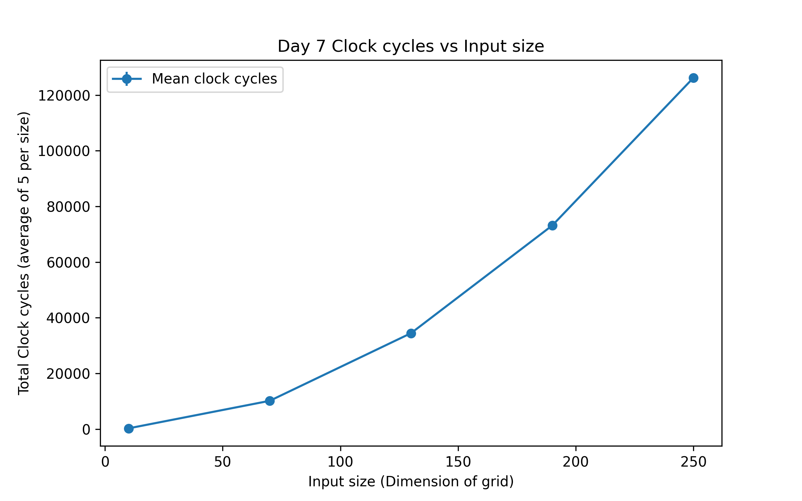
</p>

As seen in the plot, a slight quadratic trend can be seen, which aligns with expectations that performance is proportional to the number of characters in the input file.

### Key Synthesis Metrics:

The design was compiled using Quartus Prime Lite 18.1 with the target device as a 10M50DAF484C7G (the FPGA on the DE10-lite dev board) and produced the following key usage metrics:

| Metric                             | Usage                   |
| ---------------------------------- | ----------------------- |
| Logic Elements                     | 1,344 / 49,760 (3%)     |
| Registers                          | 565                     |
| Memory Bits                        | 32,768 / 1,677,312 (2%) |
| Embedded Multiplier 9-bit elements | 0 / 288 (0%)            |
| Restricted Fmax (Slow 1200mV 85C)  | 75.99 MHz               |

## Day 8:

Day 8's puzzle was about connecting junction boxes (represented as integer $(X,Y,Z)$ coordinates in 3D space) to form connected circuits. Part 1's task was to connect the 1000 closest pairs of junction boxes, using Euclidean distance as a distance metric, allowing redundant connections (e.g., two boxes that are already connected via other boxes may still be connected), and then find the product of the sizes of the three largest resulting connected components.

The aim of part 2 was to continue connecting the closest unconnected pairs until all junction boxes form a single circuit, and then return the product of the X-coordinates of the two nodes connected by the final connection.

### Algorithm Explanation

This problem is essentially an MST (minimal spanning tree) problem. The vertices are the $N$ junction boxes in 3D space, and the edges are implicit between all pairs of nodes, with a weight equal to their Euclidean distance:

$$
\text{Edge weight: } w(u,v) = \sqrt{(u_x - v_x)^2 + (u_y - v_y)^2 + (u_z - v_z)^2}
$$

This problem presented a significant challenge, as efficient MST algorithms would require all edges to be stored in memory. For the input of 1000 nodes, this is approximately $|E| = N \times (N-1) / 2 = 499,500$ edges.

Using 32-bits to store edge weights, each edge would take up 64 bits (32-bit weight, and 2 x 16-bit node indices) Storing all edges in memory, resulting in around 32Mbits of memory. While some modern FPGAs may support this amount of embedded memory, my DE10-lite does not, and furthermore, this would be a very wasteful use of memory as:

- The MST only requires $N-1 = 999$ edges, around 0.2% of the total edges

- Part 1 only needs the smallest 1000 edges

- Many edges are likely irrelevant to consider (since they are so far apart, and there might be closer nodes between the two distant ones)

#### Sparsity Heuristic

In Euclidian space, the MST edges are statistically concentrated among the shortest distances. For randomly distributed points in a cubic space:

- The expected longest MST edge length scales with $\mathcal{O}((log(n) / n)^{(1/3)})$ ([source](https://arxiv.org/abs/0905.3584))

- The "kissing number" in 3D is 12, meaning each node only has up to 12 immediate spatial neighbours

So rather than storing all edges, we can employ a bucket-based filtering approach. This approach is split into two parts:

#### Part 1: Histogram Generation

- Iterate through all pairs of nodes.

- For each pair, compute the distance between the two nodes

- Increment histogram buckets based on distance ranges:

  - Bucket 0: `dist < bucket_base`
  - Bucket 1: `dist < bucket_base*2`
  - Bucket 2: `dist < bucket_base*4`
  - And so on ...

#### Part 2: Threshold Selection and Collection

- Scan the buckets to find the smallest threshold $T$ such that the number of edges below $T$ exceeds the buffer capacity (the most amount of memory that we are willing to use to store edges)

- Re-iterate through all node pairs

- Only store edges where `dist(u,v) < T` into memory

#### Heuristic Justification

This approach cannot guarantee correct results for **all** inputs. There exist cases such as where 999 points are clustered together and the 1000th point is far enough away such that the distance between that point and any other point is larger than any pairwise distances among the rest of the 999 nodes.

However, if we assume all point coordinate values are approximately uniformly distributed between 0 and 100,000 (as appears in my real puzzle input), then the likelihood that an MST edge has a distance large enough so as to not appear in the set of edges generated by the approach above is vanishingly small.

This heuristic trades the guarantee of solution optimality for dramatic memory savings, so I made the decision that the trade-off is worth it.

#### Using the selected Edges

Once the chosen edges have been selected, Kruskal's MST algorithm can be applied to solve this problem, which is briefly described as:

- Sort the edges based on increasing order

- Initialise a Disjoint Set Union (DSU) data structure

- Iterate through the edges in sorted order:

  - If the two nodes in that edge are not in the same set inside the DSU, perform the union operation using the DSU

  - Otherwise, ignore it

### Implementation in Hardware

The design consists of four main stages, orchestrated by the top-level module.

1. The `parser` module reads nodes from the input into a "node RAM". Node RAM is a 1024 x 96-bit memory. Each entry is 96 bits, storing the `{X,Y,Z}` coordinates, 32 bits per dimension.

2. The `edge_generator` module reads nodes from node RAM and performs the heuristic-based edge generation/selection algorithm described above. Edges are stored in edge ram, in the format: `{distance, u_idx, v_idx}`, where `u_idx` and `v_idx` are the indices of `u` and `v` within node RAM. Rather than using the Euclidean distance, this module uses the squared Euclidean distance (as square root is a very expensive calculation to perform in hardware, and edge order is maintained if squared distance is used).

The edge generation process uses a pipelined structure to minimise critical path length:

<p align="center">
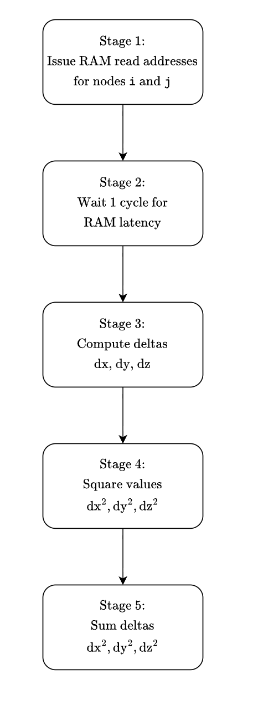
</p>

This pipeline structure is used for both the histogram phases and the threshold/collection phases.

3. The `bitonic_sorter` module sorts the edges based on distance using bitonic sort.

4. The `dsu` module maintains a disjoint set union data structure, and implements the Kruskal's algorithm process outlined above (and after the 1000th edge has been considered, computes the product of the top-3 size components before continuing with Kruskal's). The DSU maintains two arrays (RAMs) to store the `parents` and `sizes` arrays, as the DSU implements the union by size heuristic.

The diagram below shows a high level / abstract view of the top level `day08_core` module with all submodules/RAMs.

<p align="center">
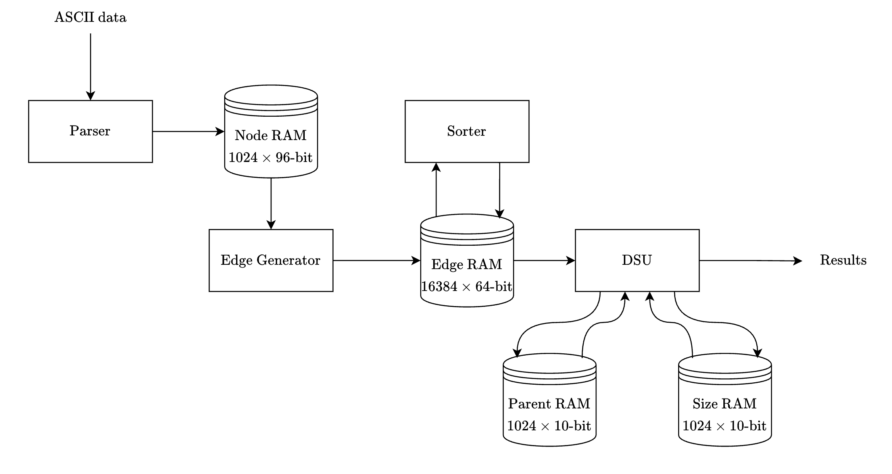
</p>

#### Bitonic Sort Explanation / Justification for Choice

I chose Bitonic sort as the sorting algorithm of choice for a few reasons here:

- It is 'in place', meaning $\mathcal{O}(1)$ additional memory is required

- It's worst case time complexity is $N \log ^2 (N)$. While not the lowest worst-case time complexity sorting algorithm, it is quite low, and beats out many other in-place algorithms like insertion-sort, bubble sort, etc.

- It uses very simple hardware; simply a bitwise xor and a comparator, along with logic to read/write to/from memory

- I've never implemented bitonic sort before and thought it would be interesting

~~If I get time before submission I'd like to try and implement heapsort, since it is also in-place, and has a better worst-case time complexity.~~

Update: A few days after writing this section of the readme, I implemented heapsort and discuss its performance gains below.

#### DSU Implementation Details / Explanation

The DSU is a data structure that keeps track of which items belong to the same set. The core idea is that each set is represented as a tree, and the root of each tree is the ID of that group. It uses two arrays:

- `parent[i]` stores the parent of node `i`
  - if `parent[i] == i`, then `i` is the root of its tree
- `size[i]` is only meaningful for roots
  - stores how many elements are in group `i`

It supports two operations:

- `find(x)`: follows the parents of node `x` repeatedly until it finds a node where the parent is itself (the root of that tree, and the ID of the group)

- `union(a,b)`: merges the group containing `a` and the group containing `b` into a single group
  - find the roots of `a` and `b`
  - if they're the same, do nothing
  - Otherwise, attach the smaller group under the larger group's root (union by size heuristic), and update the size of the new root

Using the union by size heuristic when performing a union ensures that the tree height remains logarithmic and ensures faster `find` operations.

There are other optimisations, such as path compression, however these require additional memory or additional operations, and so they were not implemented here. Additionally, since there are only 1000 nodes, a logarithmic height will not degrade performance of `find` operations significantly.

### Benchmarking and Evaluation

My day 8 solution was benchmarked similarly to previous days. It was evaluated over an average/stdev of 3 runs. Tested with varying the number of 3D points in the input from 700 to 1000, with coordinate values randomly generated between 0 - 100,000, and is shown in the plot below. My real puzzle input had 1000 points in the input. This solution took notably longer than previous days due to its complexity and inherently serial nature (e.g., edge generation can't begin until all nodes read in, edge sorting can't begin until all edges are generated, etc.).

<p align="center">
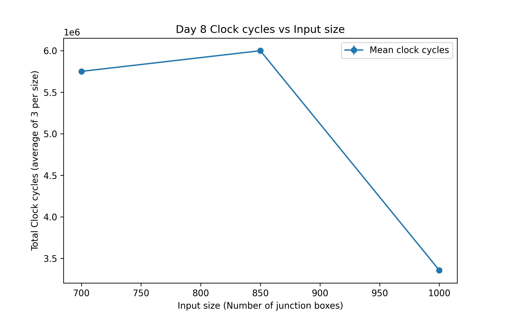
</p>

This plot may seem quite confusing (and took me a while to reason about), but it can be reasoned about, and the shape is due to the somewhat unique approach used for solving this problem.

Because of the histogram-based approach used to generate edges, the number of edges used for sorting and performing Kruskal's algorithm doesn't necessarily correlate to the number of points in the input. Based on this, I was expecting an approximately constant time (if not, then slightly quadratic due to iterating over all $N*(N-1)/2$ edges). However, when inspecting the sizes of chosen buckets for different trials, I found that for around $N=700$, the edge generator selected a bucket with around 9000 edges, while for $N=1000$, the edge generator tended to select around 7000 edges (as the next largest bucket contained too many edges to fit within edge RAM).

In benchmarking, the correctness of the solver's output was also checked, and no incorrect outputs were encountered (although with enough trials, it's inevitable that it will eventually produce an incorrect result).

### Future work

- Implement a 'sorted set' or 'sorted list' module and use it to store the 12 closest vertices to each node, and then use the 3D kissing number property to store those 12,000 edges. This uses slightly more memory than the approach I've implemented, but allows us to guarantee optimal / correct results. This approach would likely increase the number of clock cycles, as in my current implementation, I iterate over `for i in [1..n]: for j in [1..i]` **twice**, but this implementation, I would need to iterate over `for i in [1..n]: for j in [1..n]` **once**, and implement additional functionality to ensure there are no duplicate edges selected.

- ~~Implement heapsort to replace bitonic sort, which would likely reduce the number of clock cycles required for the sorting portion of the solution.~~

### Key Synthesis Metrics:

The design was compiled using Quartus Prime Lite 18.1 with the target device as a 10M50DAF484C7G (the FPGA on the DE10-lite dev board) and produced the following key usage metrics:

| Metric                             | Usage                     |
| ---------------------------------- | ------------------------- |
| Logic Elements                     | 2,839 / 49,760 (6%)       |
| Registers                          | 1526                      |
| Memory Bits                        | 603,136 / 1,677,312 (36%) |
| Embedded Multiplier 9-bit elements | 14 / 288 (5%)             |
| Restricted Fmax (Slow 1200mV 85C)  | 27.89 MHz                 |

### Update (12th January)

After implementing heapsort, a significant speedup was achieved, taking my personal puzzle input from 3,351,117 clock cycles down to 1,744,510 clock cycles. In reflection, bitonic sort was quite a poor choice given that the implementation was sequential (due to the reliance on embedded memory bits). Heap sort had the advantage of a better worst case time complexity, not needing to pad values to a power of 2, and the ability to terminate earlier, depending on input (e.g., during the heapify process, nodes might not need to sink / rise all the way through the array, compared to bitonic sort which will always take (approximately) the same number of clock cycles regardless of the ordering of the input).

<p align="center">
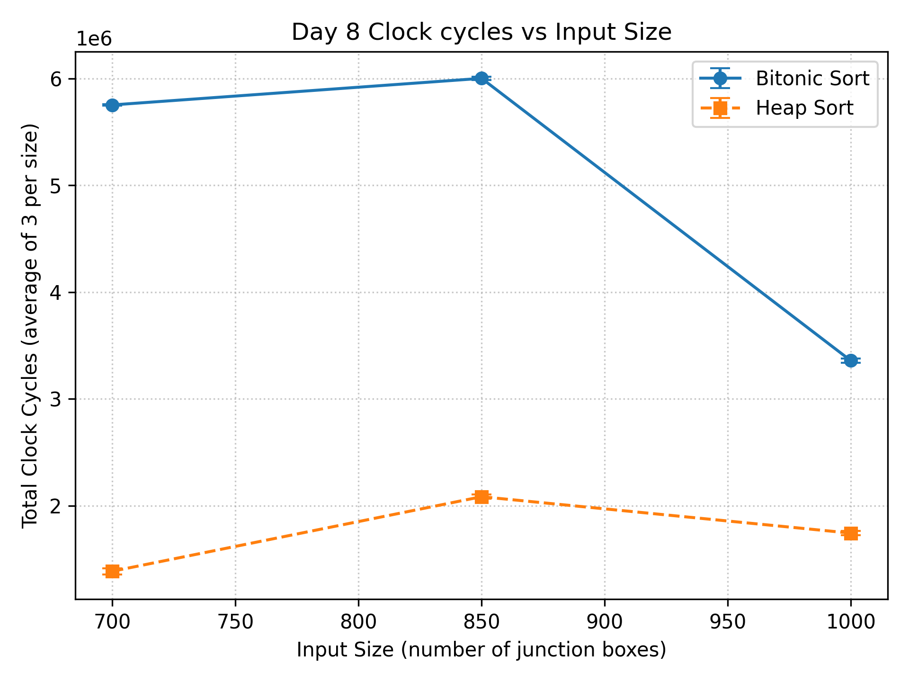
</p>

## Day 9:

Day 9's puzzle input consists of a list of 2D integer coordinates representing red tiles on a grid. The coordinates are ordered to form a closed loop where consecutive tiles are connected by straight horizontal or vertical segments.

The goal of part 1 is to find the maximum area of a rectangle whose two opposite corners are red tiles. Part 2's goals is similar, except that the region of the rectangle must fit entirely within the closed grid.

### Algorithm Overview

At a high level, the algorithm solves both parts by exhaustively checking all possible pairs of vertices:

- Part 1 is relatively straightforward, the largest seen area can simply be tracked as the vertices are iterated over

- Part 2 is slightly more involved, as it requires geometric validation to ensure the rectangle is entirely within the polygon region formed by the vertices. For this, I use two geometry techniques:

  1. Cut detection: check if any polygon edge (a segment formed by two sequential coordinates) passes through the interior of the rectangle. If so, the rectangle is invalid because it contains the outside of the polygon.

  2. Ray casting: Determine if the rectangle's centre is inside the polygon using the ray casting algorithm; cast a horizontal ray from the center rightward and count how many vertical polygon edges it crosses. An odd count means that the center is inside, even means the center is outside

A rectangle is valid for part 2 only if:

- No segment cuts through it (all tiles are in the polygon)

- Its center is inside the polygon (the number of edge crossings of the ray is odd)

### Implementation in Hardware

My approach to solving this puzzle uses a pipelined hardware architecture that processes all possible rectangle pairs, whilst simultaneously validating them against the geometric constraints for part 2.

The solution can be broken into three main phases:

1. Parse and store the coordinates from the input: Read the input character-by-character and store them in dual port RAM for access later.

2. Build segment pipeline: Load the polygon segments (edges connecting consecutive tiles) into a multi-stage pipeline

3. Process all coordinate pairs (all rectangles): iterate through all unique pairs of tiles, computing part 1 areas and maintaining that maximum accumulator, whilst also feeding candidate rectangles through the pipeline for applying the part 2 validation checks.

#### Early Pruning:

In part 2, we only feed rectangles that are larger than the current best-seen part 2 result. In practice this saves a lot of time, since the main computation bottleneck is the pipeline itself.

#### Architecture Overview:

The design uses a chunked pipeline approach, where polygon segments are distributed across multiple pipeline stages; each stage stores a subset of the segments locally, and performs these collision/containment checks in parallel.

Initially, I considered having a pipeline stage for every segment, which would reduce the time complexity for part 2's solution from $\mathcal{O}(n^3)$ to an amortised $\mathcal{O}(N^2)$, however the puzzle input had 496 points, which would require 496 pipeline stages (completely infeasible). Rather than this, I made the decision to allow each stage to store multiple segments. Which this increases the number of clock cycles requires, it makes the actual design feasible, so it's a necessary trade-off.

<p align="center">
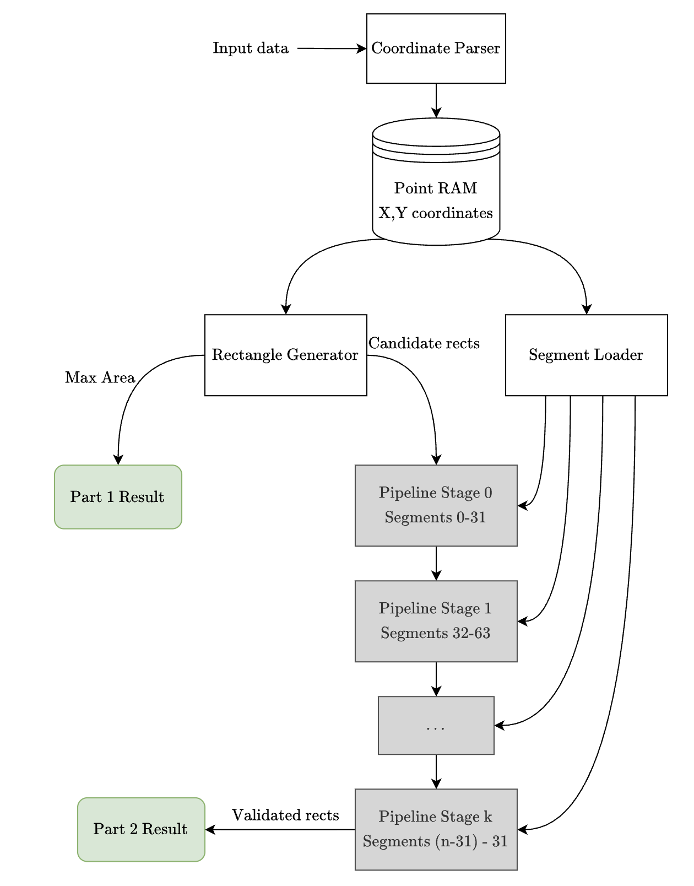
</p>

With this approach, a candidate rectangle is fed into the first pipeline stage, and that first stage will process the candidate rectangle with the first 32 segments, after which the next candidate rectangle is fed into pipeline stage 0, and the current rectangle in stage 0 is fed into stage 1. This allows $512/32 = 16$ candidates to be processed in parallel when the pipeline is full.

#### Pipeline Stage Design

Each pipeline stage implements a ready/valid handshake protocol for flow control to ensure that stages only read in data or pass data forward when the previous or next stage has finished processing (respectively).

Some optimisations were made in the [pipeline stage implementation](verilog/day09/pipeline_stage.v):

- Short circuit evaluation: If a cut is detected, the pipeline stage implements short circuit detection to end processing early (so it becomes ready for the next candidate rectangle as early as possible), since this current rectangle has been invalidated, so there's no need to perform further calculation

- Early pruning: mentioned above, only candidate rectangles with area larger than the current best are fed into the pipeline

- Prefetching: pipeline stages prefetch the next segment while processing the current segment if it is ready

### Alternative approaches / Optimisations:

- Serial implementation: Removing the pipeline and simply performing the $\mathcal{O}(N^3)$ approach would reduce the amount of logic usage, but drastically degrade performance

- Increased parallelism: Using more stages would improve throughput, which would result in noticeable performance gains for larger inputs

### Benchmarking and Evaluation

My day 9 solution was benchmarked similarly to previous days. It was evaluated over an average/stdev of 5 runs. Tested with varying the number of points in the input from 20 to 500. The input generation was done by starting with a large square, and iteratively taking rectangular chunks out of corners to increase the number of points whilst maintaining the properties of the input. If interested, the input generation process can be seen [here](verilog/scripts/generate_input.py#L702). I'm unsure if the real inputs are generated in this way or in another way, however I think it's unlikely that a different method of input generation would produce significantly different results on the benchmark. The results of the benchmark are shown in the plot below. My real puzzle input had 496 points in the input file.

<p align="center">
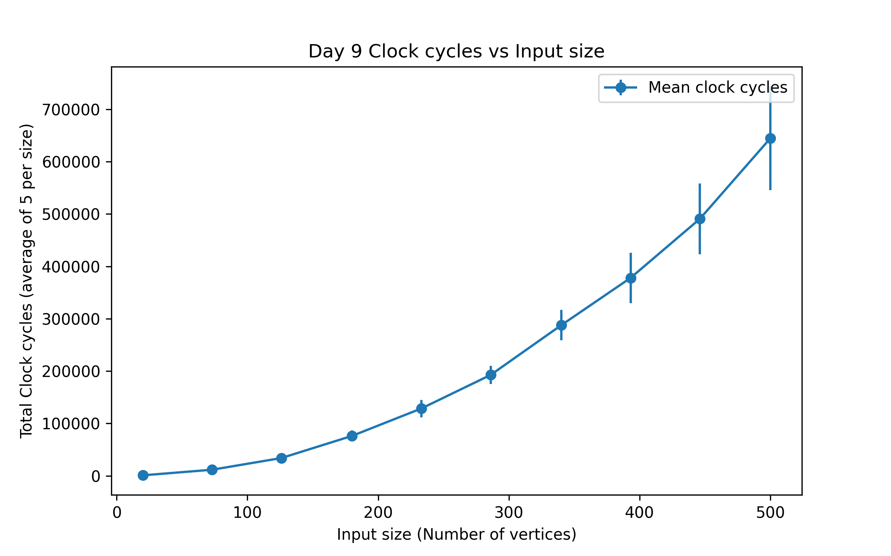
</p>

This benchmark exhibits a polynomial relation between the input size and the number of clock cycles taken, which is to be expected based on the analysis/discussion of the approach done above. The stdev tends to increase and become more noticeable as the input size increases, and this is likely due to the short circuiting and early pruning, as these will depend on the actual coordinates/numbers in the input (which has been randomly generated, and is different for each trial).

### Key Synthesis Metrics:

The design was compiled using Quartus Prime Lite 18.1 with the target device as a 10M50DAF484C7G (the FPGA on the DE10-lite dev board) and produced the following key usage metrics:

| Metric                             | Usage                   |
| ---------------------------------- | ----------------------- |
| Logic Elements                     | 12,767 / 49,760 (26%)   |
| Registers                          | 5500                    |
| Memory Bits                        | 55,808 / 1,677,312 (3%) |
| Embedded Multiplier 9-bit elements | 9 / 288 (3%)            |
| Restricted Fmax (Slow 1200mV 85C)  | 41.18 MHz               |

## Day 10:

Coming soon

## Day 11:

Day 11's puzzle was about finding the number of paths through a mess of wires on a server rack. The input contains a list of devices, and for each device, the other devices that this device is directly connected to. We can model this as a path-counting problem in an acyclic graph.

Part 1 of the puzzle was to count all distinct paths from the device named `you` to the device named `out`.

Path 2 of the puzzle was to count all distinct paths from the device `svr` to the device named `out` that visit both `dac` and `fft` (in any order).

Random note: I solved this problem in MIPS assembly language when completing Advent of Code. Between that and HDL it's hard to say which one took more debugging :p. Feel free to check it out [here](https://github.com/rates37/aoc-2025/tree/main/day11)!

### Core algorithm / approach taken

The core algorithm I used was a memoised depth-first search (DFS), which is virtually equivalent to a dynamic programming problem on the graph's topological order.

We can define for any two nodes $u$ and $v$:

$$
\text{paths}(s,t) = \begin{cases} 1 & \text{if } s = t,
 \\ \sum_{v \in \text{neighbours}(s)} \text{paths}(v, t) & \text{otherwise} \end{cases}
$$

(GitHub renders the equation above quite poorly 🥲)

It is critical to memoise (store results of subproblems) for this problem, as without it, the recursion would revisit the same subproblems exponentially. With memoisation, each node is computed exactly once (provided it is even reachable from the start node), yielding an $\mathcal{O}(V + E)$ time complexity.

#### Path 2 Decomposition:

Part 2 requires paths through both `dac` and `fft` between `svr` and `out`. Rather than tracking the visited state during traversal, we can instead decompose this into independent path counts (as this has less strain on memory usage):

$$
\text{Part 2 answer} = \text{paths}(\texttt{svr} \to \texttt{dac}) \times \text{paths}(\texttt{dac} \to \texttt{fft}) \times \text{paths}(\texttt{fft} \to \texttt{out}) \\ + \text{paths}(\texttt{svr} \to \texttt{fft}) \times \text{paths}(\texttt{fft} \to \texttt{dac}) \times \text{paths}(\texttt{dac} \to \texttt{out})
$$

This allows us to reuse the exact same function from part 1, and the only change is simply changing the start and end nodes, to compute each sub-path.

#### Early Termination Condition

Since the input given is a directed acyclic graph (DAG), the following statement **must** hold true (otherwise it would violate the properties of a DAG):

Exactly one of $\text{paths}(\texttt{fft} \to \texttt{dac})$ or $\text{paths}(\texttt{dac} \to \texttt{fft})$ must be zero.

If both were non-zero, then there would be a cycle through `fft` and `dac`, which would mean the graph is no longer acyclic.

This property allows us to terminate early; when computing part 2, first check the number of paths from `dac` to `fft`. If this number is zero, then we know that there are no paths that follow `svr -> dac -> fft -> out`, and so don't need to compute any of the sub-paths `svr -> fft` or `dac -> out`. Conversely, if the number of paths from `dac` to `fft` is non-zero, then we know that we don't need to compute any of the sub-paths along `svr -> dac -> fft -> out`. This means that we only need to call the $\text{paths}$ function either 3 or 4 times to calculate part 2's result (instead of the 6 times without this optimisation). On average, this reduces part 2's computation by 33-50%, which is a significant margin.

### Implementation in Hardware

Since this solution is very software-y, it is quite complex to implement in plain HDL. To help with this, I decomposed the solution into four main modules (along with a series of RAM modules to store graph data).

#### Name Resolver

This module is used to convert 3-character ASCII names into unique 10-bit node IDs using a perfect hash function:

$$
\text{hash}(\texttt{abc}) = a \times 676 + b \times 26 + c
$$

Where $a$, $b$, and $c$ are interpreted as a number from 0 to 25 (their position in the alphabet). This maps the $26^3 = 17,576$ possible names (`aaa` to `zzz`) to unique memory addresses, eliminating the need for collision handling.

Note: the 10-bits for ID is chosen as I set the max number of nodes supported to 1024. If the max nodes parameter is increased, then the width of the 10-bit node ID would also need to increase.

This hash table requires 17,576 10-bit entries, which is a large overhead for small graphs, however given the $\mathcal{O}(1)$ lookup times, it is an acceptable trade-off. If the input node set was known to be significantly small, a collision-handling hash approach would reduce the memory requirements, at the cost of additional clock cycles and logic usage to handle collisions.

#### Graph Manager

This module stores the graph in **compressed sparse row (CSR)** format. CSR format is essentially a dense array of edges, where edges leaving the same node are adjacent in the array. This approach is used, as this way, the outgoing neighbours of each node can be identified by simply mapping node ID to the start index of outgoing edges within the array of edges.

This approach was chosen over an adjacency list style 2D array, as the number of outgoing edges from each node varies, and thus using a 2D matrix would waste space in memory.

The diagram below shows the two "arrays" (RAMs in the case of my implementation) that this graph manager class needs to store:

<p align="center">
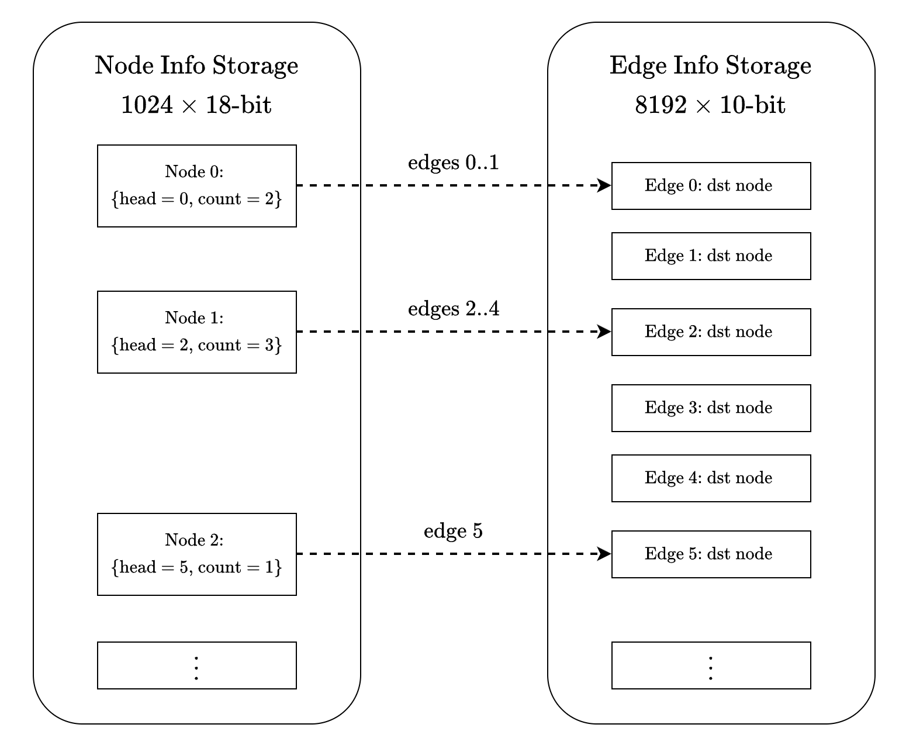
</p>

The fields stored in the left for each node are:

- `head` - the starting index in the edge array
- `count` - the number of outgoing edges from the current node

On the right, each entry simply stores a 10-bit node index representing the destination of that edge.

I have not identified a notable drawback to the choice of graph representation here. CSR is memory efficient and dense, but requires $\mathcal{O}(\text{degree})$ time to iterate over edges (as opposed to an $\mathcal{O}(1)$ lookup time for an adjacency matrix), but since we don't need to check for edge existence in this problem (we only need to traverse adjacent edges), this 'drawback' does not affect the quality/performance of solution here.

#### Path Counter:

Implements a non-recursive DFS using a LIFO stack memory and memoisation table (stored in a RAM). This module gets used to compute both part 1 and 2 answers after the graph has been read into the graph manager.

Each stack frame contains the following data:

| Field        | Width   | Description                                     |
| ------------ | ------- | ----------------------------------------------- |
| `node`       | 10 bits | Current node ID                                 |
| `edge_start` | 13 bits | Starting edge index                             |
| `edge_count` | 5 bits  | Total number of nodes this node is connected to |
| `edge_idx`   | 5 bits  | Current neighbour index                         |
| `sum`        | 64 bits | Accumulated path count                          |

In its current state, the maximum stack depth is only set to 64, which saves a lot on registers, but means that technically, this approach could produce incorrect results for some edge case graphs. However, this module was tested repeatedly with randomly generated graphs of size up to 750 nodes, and this was not an issue that was encountered at all (although it is still important to acknowledge the drawback's existence).

The memoisation table is implemented as (yet another) RAM, storing 64-bit values. However, since the path counter module will be utilised multiple times, this RAM would ordinarily require resetting. However, since the memo table needs to store entires for every possible destination node, this clearing operation would become quite inefficient.

To overcome this, I create an additional bit vector to store 'valid' indicators for each index in the RAM. This way, rather than "resetting" the RAM contents, it can simply be marked all as invalid, with a single operation. Using registers for this validity bit array is essential, as if RAM/memory blocks were used, then they would need to be sequentially cleared (as opposed to how registers can be cleared in parallel, in a single clock cycle).

#### Diagram of Connections Between Modules and Flow of Data:

<p align="center">
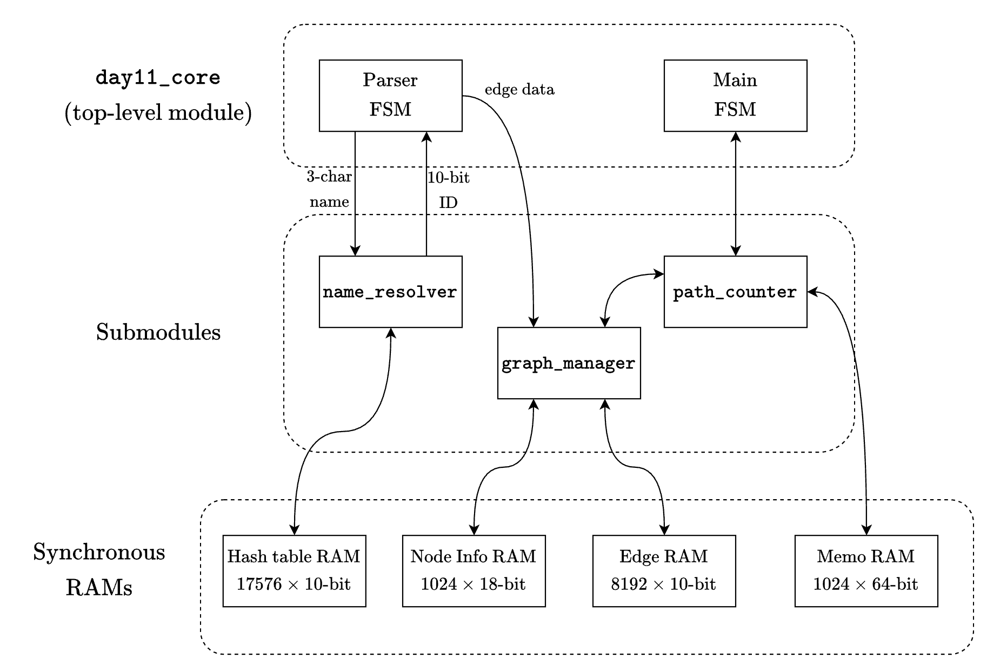
</p>

### Scalability, Improvements, Architecture

The current design is not pipelined, as each memory access stalls the FSM. This was done simply to save time during development. Possible improvements could include:

- pre-fetching data, i.e., it is fetched while performing computations, as opposed to completing computation and fetching afterward

- parallel memo check, could read the memo synchronous RAM speculatively before/during confirming the validity in the bit vector. This would save a clock cycle while checking validity, and then based on validity, the result can either be returned (if the data is valid), or the actual result can be computed (if the data is not valid).

In its current implementation (and the implementation that was used for benchmarking and synthesis), the following parameters were set. With each one, they impose slightly different restrictions on the scalability of the design. However, they can all be easily increased (this would just require the use of more logic cells, memory blocks, etc.)

| Parameter         | Currently set to      |
| ----------------- | --------------------- |
| `MAX_NODES`       | 1024                  |
| `MAX_EDGES`       | 8192                  |
| `MAX_STACK_DEPTH` | 64                    |
| Path count        | Uses a 64-bit integer |

For graphs that are known to have longer paths (i.e., longer than the stack depth), the stack depth would need to be increased. In theory, the worst-case stack depth is be equal to the number of nodes in the graph - 1, however in practice with randomly generated graphs (and the graph I got as a puzzle input), a stack depth of 64 seems to be sufficient.

### Benchmarking and Evaluation

My day 11 solution was benchmarked similarly to previous days. It was evaluated over an average/stdev of 5 runs. Tested with varying the number of nodes in the graph, with an out-degree of each node as a randomly generated number between 1 and 16. The number of nodes was varied from 20 to 750. My real puzzle input had 583 nodes.

<p align="center">
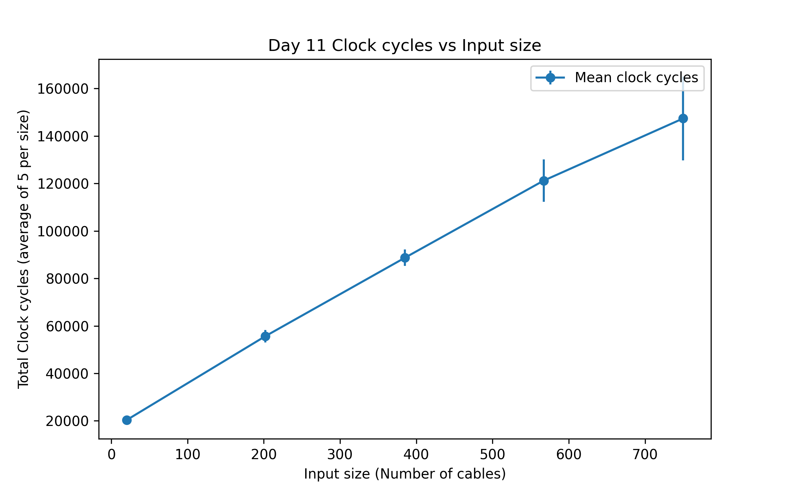
</p>

As seen in the plot, an approximate linear trend can be seen to exist, which aligns with expectations that performance is $\mathcal{O}(V + E)$ - i.e., approximately linear with respect to the number of nodes in the input graph.

### Key Synthesis Metrics:

The design was compiled using Quartus Prime Lite 18.1 with the target device as a 10M50DAF484C7G (the FPGA on the DE10-lite dev board) and produced the following key usage metrics:

| Metric                             | Usage                     |
| ---------------------------------- | ------------------------- |
| Logic Elements                     | 13,365 / 49,760 (27%)     |
| Registers                          | 6360                      |
| Memory Bits                        | 344,080 / 1,677,312 (21%) |
| Embedded Multiplier 9-bit elements | 40 / 288 (14%)            |
| Restricted Fmax (Slow 1200mV 85C)  | 58.71 MHz                 |

## Day 12:

Day 12's problem was a polyomino tiling puzzle. The problem input contained a sequence of shapes, followed by a list of region areas, along with the amount of each shape that needs to fit into that area. The aim was to return the number of regions that can fit the associated number of shapes in them. This is a known NP-hard problem, and can't be feasibly solved in a reasonable amount of time in software (and as far as I'm aware, this applies to hardware as well).

However, the puzzle inputs to this problem had an additional property that was not strictly stated in the puzzle specification; the queries were separated into two categories:

- Trivially Impossible: The total area of the shapes does not fit in the region. It's pretty easy to see why this is impossible to satisfy

- Trivially Possible: The region was large enough to allow the tightest rectangular bounding box to be used for all shapes and would still accommodate all shapes.

Knowing this property of the inputs made solving the problem relatively easy compared to some of the other days.

Because of this ease, I decided to implement this day **only in Hardcaml**. For most of the other days I have used Hardcaml for so far, I typically created a HDL solution in Verilog first and then (roughly) translate it to Hardcaml. So I made this choice to prove to myself that I can write Hardcaml independently of Verilog.

The solution itself is quite simple and straightforward (the parser/decoder was the most challenging part!). I used functors to parameterise the interfaces to the modules for day 12 (a technique I didn't use for the other days that I've solved with Hardcaml so far), which I found quite interesting. While I still feel quite new to Harcaml, I'm looking forward to trying it out again in the future.

# Usage Notice

This project is open source under the MIT License.
While you are legally allowed to copy and reuse the code, I kindly ask that you
do not take credit for my work, and if you are also competing in [Advent of FPGA](https://blog.janestreet.com/advent-of-fpga-challenge-2025/),
then please uphold the integrity of the competition, by not taking ideas from these
works (at least until the competition submission period has passed).

# FAQs:

### Why Verilog?

I like Verilog for its combination of simplicity and fairly easy to imagine exactly what hardware circuit it might synthesize to. Other HDLs introduce useful abstractions which I definitely appreciate, but I find the comparatively manual nature of the 2001 Verilog standard (mostly) charming (with the exception of not allowing unpacked arrays in module ports).

I also taught Verilog through an introductory Digital Systems course at my university for four years in a row which has made me quite familiar with it.

### Why are your Ocaml / Hardcaml approaches weird?

I started learning Ocaml in mid-December 2025, I'm very new to the language so I'm not familiar with the idiomatic way to do things just yet (I'm open to feedback if you have any!).

I haven't looked at anyone's advent of fpga attempts (including last year) to force myself to find / create approaches to tasks, after submission I'm keen to look at other's solutions and see how I could have improved.

### Why do both Hardcaml and Verilog?

Verilog - for fun

Hardcaml - to learn something new!

### How long did you spend working on this?

I lost track, but a good chunk of my limited free time in the christmas / new year's period was dedicated to this.

# Todos / Task List:

- [ ] Check todos in completed days to resolve issues, etc.
